# MIND YOUR OWN BUSINESS
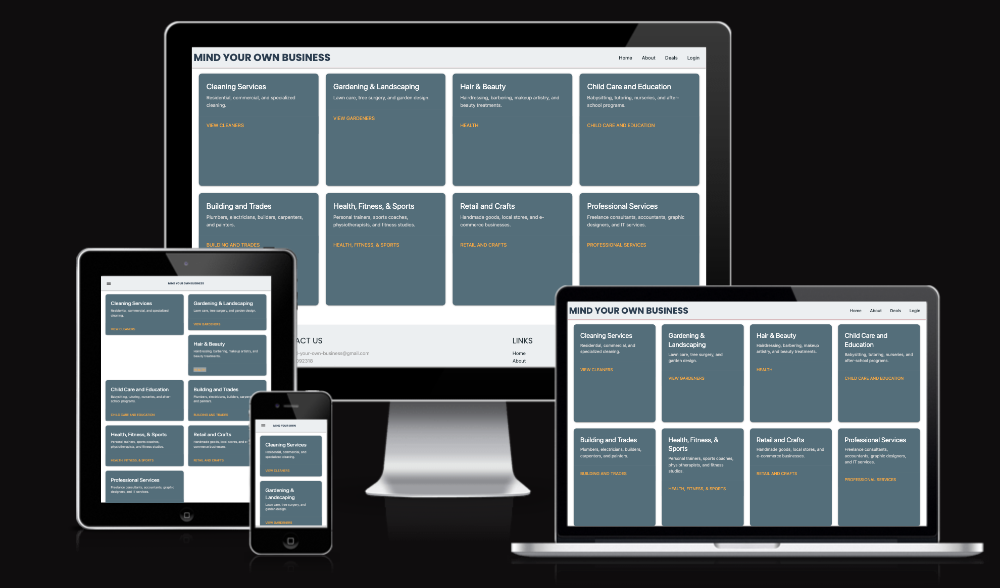
[Click here to view the live website](https://mind-your-own-business-5f784ff22ecb.herokuapp.com/)


# (Overview) Mind Your Own Business

**Mind Your Own Business** is an online platform designed to empower **sole traders and small businesses** by making promotion simple, effective, and hassle-free.

## 🚀 Helping Small Businesses Get Noticed  

As a former self-employed business owner running **DL Cleaners**, I quickly realized that the hardest part of growing a business wasn't the work itself—it was getting noticed. Finding customers, promoting deals, and building a local presence often felt like an uphill battle.  

That's why I created **Mind Your Own Business**—a platform for **small business owners**, including **cleaners, nail technicians, personal trainers, landscapers, childminders, and tradespeople**, to **showcase their services and attract customers** without relying on expensive advertising.

## 🔹 How It Works  

- ✅ **Create a Business Profile** – Register and build a profile to introduce your business, services, and contact details.  
- ✅ **Promote Your Services** – Easily add deals and special offers to attract local customers.  
- ✅ **Browse Local Businesses** – Users can explore promotions and discover trusted businesses in their area.  
- ✅ **Exclusive Access for Registered Users** – While promotions are visible to everyone, only registered members can view business profiles and connect with owners.

## 💡 Why Choose Mind Your Own Business?  

Whether you're a **mobile hairdresser offering discounts, a cleaner looking for more clients, or a builder running a limited-time deal**, **Mind Your Own Business** helps you connect with the right customers and grow your business effortlessly.

📢 **Join today and start promoting your business!** [Join Now](https://mind-your-own-business-5f784ff22ecb.herokuapp.com/register)

## 🔑 Key Features  

- **🆓 Free Business Listings** – Create a profile and showcase your business at no cost.  
- **📢 Easy Promotion** – Post deals, discounts, and promotions to attract customers.  
- **📍 Local Business Discovery** – Users can find and connect with trusted businesses in their area.  
- **🔐 Member-Only Access** – Only registered users can view full business profiles and connect directly.  
- **💬 Customer Engagement** – Encourage reviews and feedback to build trust with potential clients.  
- **📱 Mobile-Friendly** – Seamlessly browse and manage your business from any device.  
- **🔍 Search & Filter Options** – Easily find businesses and promotions based on category and location.  

## 👤 UX / User Stories  

To ensure a seamless experience, **Mind Your Own Business** is designed with the following user stories in mind:

### 🔹 As a Business Owner:
- I want to **create a business profile** so that I can showcase my services and contact details.  
- I want to **add promotions and special deals** to attract more customers.  
- I want to **edit or update my profile and promotions** easily.  
- I want my business to **be visible to users within a 10-mile radius** to target local customers.  
- I want to **see how many users view my business profile** to track engagement.  
- I want to **receive messages from interested customers** to increase sales.  

### 🔹 As a Customer:
- I want to **browse local businesses** so that I can find services near me.  
- I want to **filter businesses by category, location, and deals** to find relevant offers.  
- I want to **view business details and contact information** to connect with service providers.  
- I want to **read customer reviews and ratings** to make informed decisions.  
- I want to **create an account** so I can access more details about businesses.  
- I want to **save favorite businesses** for future reference.  

### 🔹 As a Platform Admin:
- I want to **manage user accounts** to ensure a secure and spam-free experience.  
- I want to **moderate business listings and promotions** to prevent misuse.  
- I want to **remove inactive or fraudulent accounts** to maintain platform integrity.  
- I want to **analyze platform usage data** to improve user experience and features.  

## 🔮 Future Features  

🚧 *Upcoming enhancements to improve user experience and business visibility:*  

- **📍 Location-Based Listings** – Businesses and promotions will be displayed only within a **10-mile radius** of the user’s location.  
- **🔎 Advanced Search & Filters** – Users will be able to filter businesses by category, ratings, and proximity.  
- **⭐ Customer Reviews & Ratings** – Implementing a review system where customers can leave feedback and rate businesses.  
- **📅 Event & Booking System** – Businesses will be able to list upcoming events or accept customer bookings directly.  
- **📨 Messaging System** – Secure in-app messaging for direct communication between businesses and customers.  
- **📊 Business Insights Dashboard** – Analytics for business owners to track views, engagement, and customer interactions.  
- **🔐 Forgot Password Functionality** – Users will be able to securely reset their password via email if they forget their login credentials.  
- **🗺️ Area-Specific Search Results** – Users will only see businesses located in or near the **specific area they searched for**, improving local relevance.

## 📱 Responsive Design  

Mind Your Own Business is fully responsive, ensuring a smooth experience across **desktop, tablet, and mobile** devices.

### Wireframes
*The following wireframes were created to plan the structure of the website.*  
#### 🖥️ Desktop  

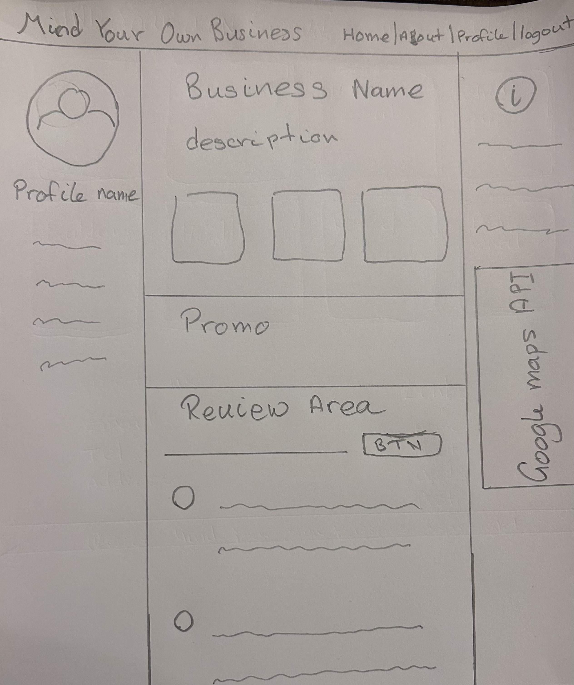


#### 📱 Mobile  
*These are live screenshots of the implemented design on desktop and mobile devices.*


### Actual Website
#### 🖥️ Desktop  
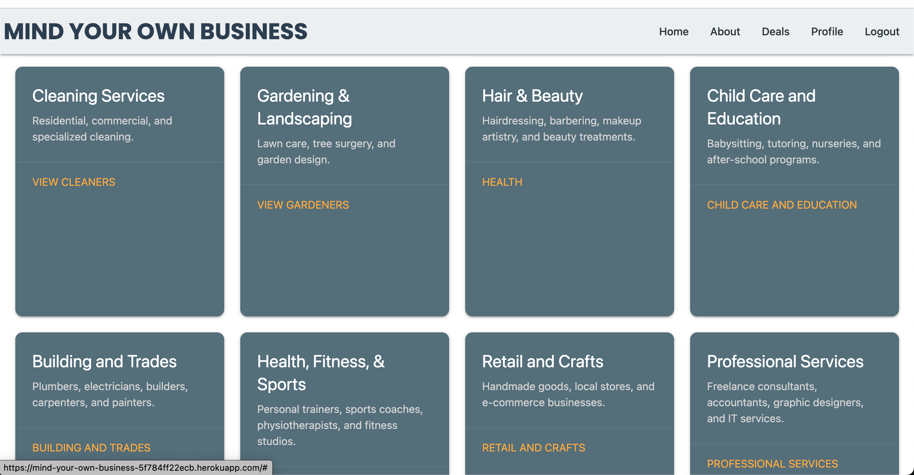
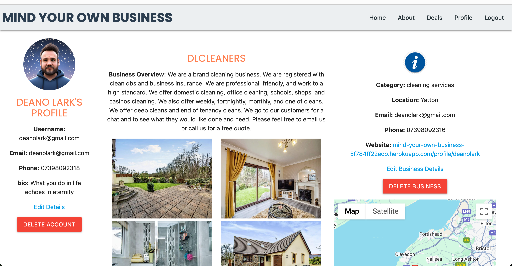
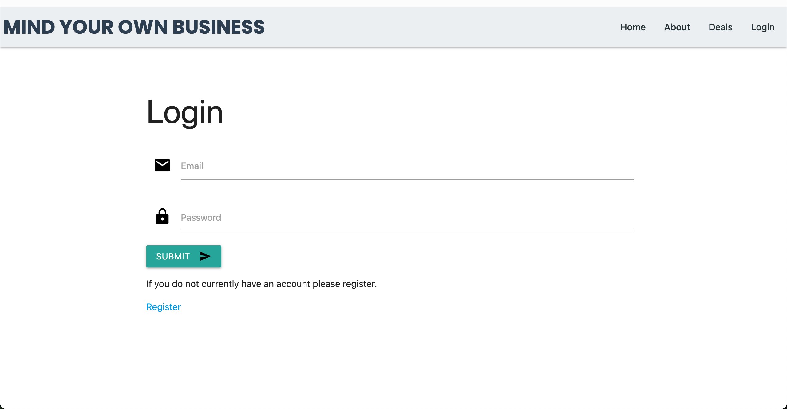
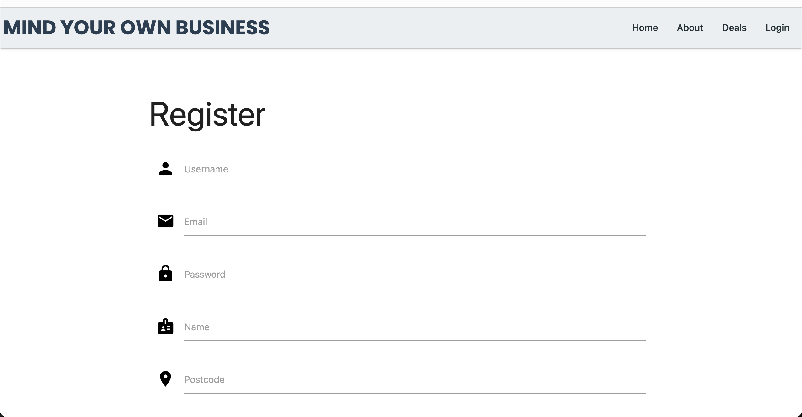

#### 📱 Mobile  
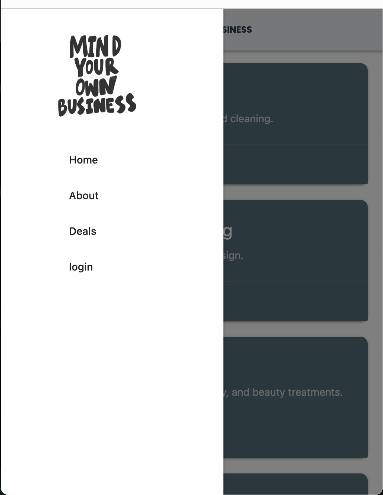
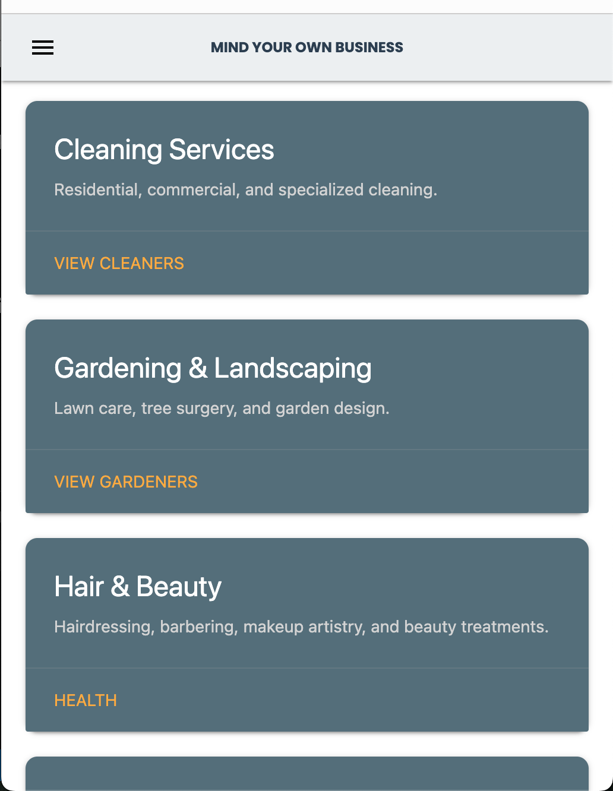
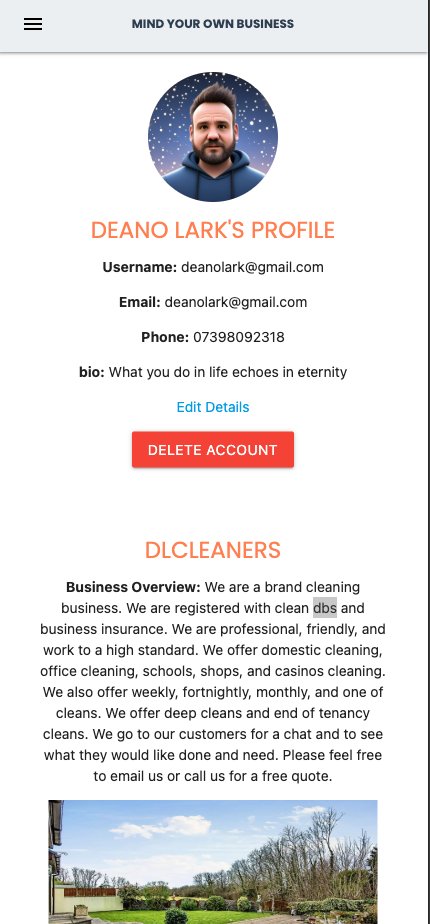
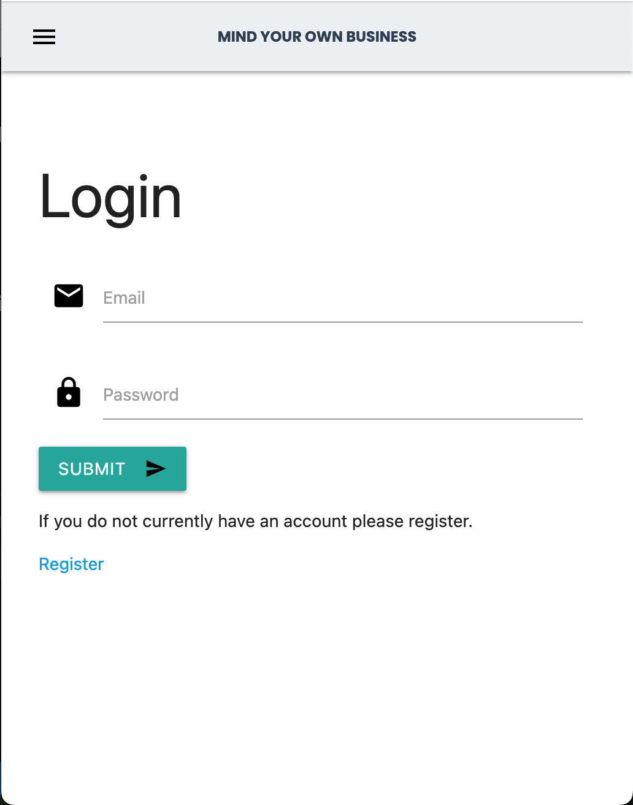
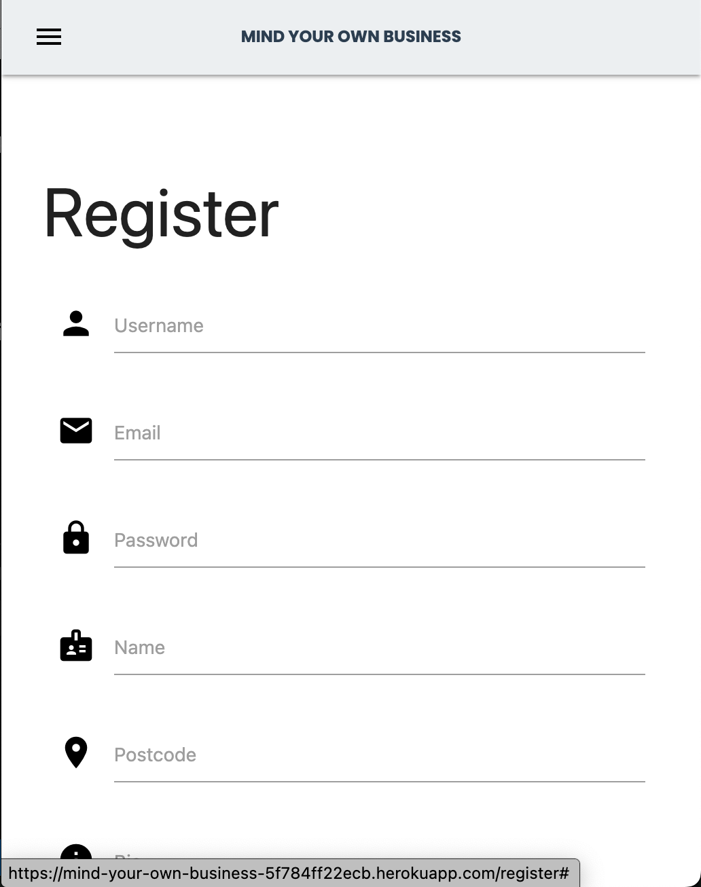

## 🛠️ Technologies and Tools Used  

### **Frontend**  
- **HTML5** – Provides the foundational structure of the website.  
- **CSS3** – Used for styling and responsive design.  
- **JavaScript** – Enables dynamic content and interactivity.  

### **Backend**  
- **Python** – The core programming language for the application.  
- **Flask** – A lightweight web framework used for building the backend.  
- **Jinja Template Engine** – Used for rendering dynamic HTML pages.  

### **Database & APIs**  
- **MongoDB** – A NoSQL database used to store business and user data.  
- **Google Maps API** – Used for fetching and displaying business locations on a map.  

### **Development & Version Control**  
- **Visual Studio Code** – The primary code editor for development.  
- **GitHub** – For version control, collaboration, and deployment integration.  

### **Deployment & Hosting**  
- **Heroku** – The platform used to deploy and host the application.  
- **Gunicorn** – A WSGI server for running the Flask application in production.  

## 🎨 Design Overview  

Mind Your Own Business is designed to provide a **user-friendly experience** for both business owners and customers. The platform features a **clean, intuitive interface** that makes it easy to browse businesses, post promotions, and connect with local services.

### 🖥️ Live Demo  
🔗 **Check out the live website:** [Mind Your Own Business](https://mind-your-own-business-5f784ff22ecb.herokuapp.com/)

### 🎯 Design Goals  
- **Simplicity** – A streamlined, hassle-free experience for users to find businesses and post promotions.  
- **Accessibility** – Fully responsive, ensuring smooth functionality across desktop, tablet, and mobile devices.  
- **Local Focus** – A location-based approach to show businesses and deals within a **10-mile radius** of the user.  
- **Authentication** – Secure login system for businesses to manage profiles and customers to engage with listings.  

### 📌 UI & UX Features  
- **👤 User-Friendly Navigation** – A simple, intuitive interface for easy browsing and interaction.  
- **🌍 Location-Based Listings** – Businesses and promotions are tailored to local customers.  
- **🎨 Responsive & Modern Design** – Built with **Materialize** for a clean, professional look.  
- **🔒 Secure Authentication** – Users must register to access full business profiles and engage with owners.  

## 🧠 Design Decisions  

### 🪟 Introductory Pop-Up Window

To enhance user engagement and clearly communicate the platform's purpose, I implemented a **pop-up window that appears when users first visit the site**. This window serves as a brief introduction and welcome message, helping first-time visitors understand the site's core value and how to get started.  

The goal is to ensure users don’t feel lost or confused upon arrival, especially since the platform offers unique features for both business owners and customers.  

🔹 **Benefits of the Pop-Up Window**:
- Improves first-time user understanding and retention  
- Clearly highlights the platform's value proposition  
- Encourages users to register or explore promotions right away  


## ✅ Testing  

### 🛠️ Functional Testing  

| Action | Expected Behaviour | Pass/Fail |
|--------|--------------------|-----------|
| User registers a new account | Account is created, and the user is redirected to their profile/dashboard | ✅ Pass |
| User logs in with valid credentials | User is successfully authenticated and redirected to the homepage | ✅ Pass |
| User logs in with incorrect credentials | Error message is displayed, and login is not allowed | ✅ Pass |
| Business owner creates a profile | Business profile is saved and visible on the platform | ✅ Pass |
| User adds a promotion | Promotion is saved and displayed under the business profile | ✅ Pass |
| User tries to access a business profile without logging in | Access is restricted, and login prompt is displayed | ✅ Pass |
| Search function is used | Businesses matching the search criteria are displayed | ✅ Pass |
| Promotions are displayed on the homepage | Active promotions are shown to all users | ✅ Pass |
| Logged-in user views a business profile | Full business details, including promotions, are visible | ✅ Pass |
| Non-logged-in user views promotions | Promotions are visible, but full business details require login | ✅ Pass |
| Business owner edits their profile | Changes are saved and updated on the platform | ✅ Pass |
| Business owner deletes their profile | Profile is removed from the system | ✅ Pass |
| User logs out | Session is cleared, and user is redirected to the homepage | ✅ Pass |


### ✅ HTML Validation  
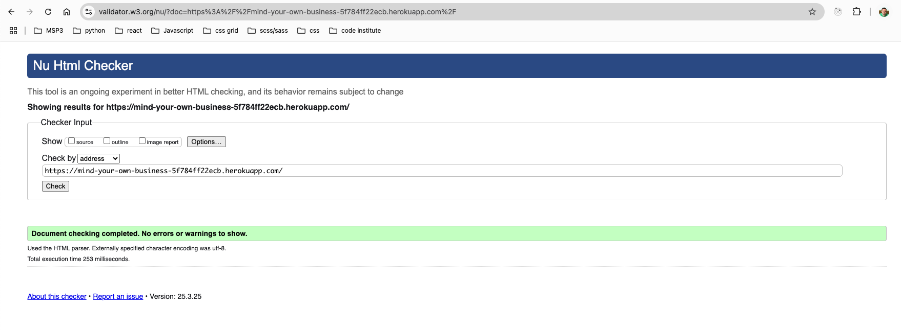  
> This project’s HTML has been validated using the official [W3C Markup Validation Service](https://validator.w3.org/), ensuring well-structured and standards-compliant markup.

---

### 🎨 CSS Validation  
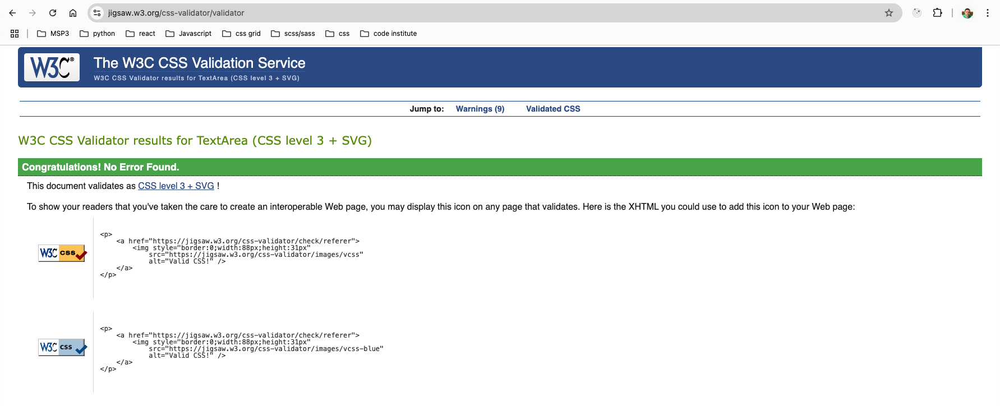  
> The CSS has been checked via the [W3C CSS Validation Service](https://jigsaw.w3.org/css-validator/) for potential errors and compatibility issues.

---

### 🧠 JavaScript Validation with JSHint  
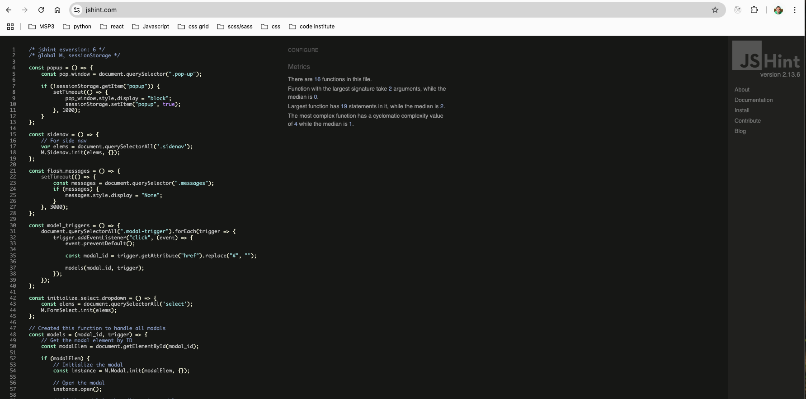  
> This project uses [JSHint](https://jshint.com/) to identify potential problems in the JavaScript code, ensuring code quality, consistency, and adherence to modern best practices.


## Deployment
1. **Design the Website on GitPod**:
   - Open GitPod and create a new workspace.
   - Design and develop your website within the GitPod environment.

2. **Push the Website to GitHub**:
   - Initialize a Git repository in your GitPod workspace:
     ```sh
     git init
     ```
   - Add all the project files:
     ```sh
     git add .
     ```
   - Commit the changes with a meaningful message:
     ```sh
     git commit -m "Initial commit"
     ```
   - Add your GitHub repository as a remote:
     ```sh
     git remote add origin <your-github-repo-url>
     ```
   - Push the changes to GitHub:
     ```sh
     git push -u origin main
     ```
## Cloning this repository

1. Open your prefered terminal.

2. Navigate to the directory where you want the cloned directory to be added.

3. Run the following command 
```sh
git clone https://github.com/DeanoPHP/msp3
```

4. After cloning, navigate into the directory
```sh
 cd your-repository-name
```

5. Now you can start working on the project on your local machine.

## Forking this repository
1. Go to the repository on GitHub.

2. In the top-right corner of the page, click the "Fork" button.

3. Once the repository has been forked, you will be taken to your copy of the repository in your GitHub account.

4. Clone your forked repository to your local machine:
```sh
git clone https://github.com/DeanoPHP/msp3
```

5. Navigate to the cloned directory
```sh
  cd your-repository-name
```

6. You can now make changes to your fork and submit pull requests to the original repository.

## 🚀 Deploying to Heroku  

This project is deployed to **Heroku** using **GitHub integration** for automatic updates. Follow the steps below to set up and deploy your Flask application.

### **1️⃣ Prerequisites**  
Before deploying, ensure you have:  
- A **GitHub repository** with your project code.  
- A **Heroku account** – [Sign up here](https://signup.heroku.com/) if you don’t have one.  
- The **Heroku CLI (optional)** – Install it from [Heroku CLI Docs](https://devcenter.heroku.com/articles/heroku-cli) if needed.  

---

### **2️⃣ Create a New Heroku App**  
1. Log in to **Heroku** and go to your [Dashboard](https://dashboard.heroku.com/).  
2. Click **"New" → "Create New App"**.  
3. Enter a **unique app name** and select your **region** (United States or Europe).  
4. Click **"Create App"**.  

---

### **3️⃣ Connect GitHub for Auto Deployment**  
1. In the **Heroku Dashboard**, go to the **Deploy** tab.  
2. Under **"Deployment Method"**, select **GitHub**.  
3. Click **"Connect to GitHub"** and authorize Heroku to access your repositories.  
4. Search for your **GitHub repository name** and click **"Connect"**.  
5. Scroll down to **"Automatic Deploys"**, and click **"Enable Automatic Deploys"**.  
   - This ensures Heroku will deploy updates whenever you push changes to **GitHub’s main branch**.  

---

### **4️⃣ Set Up Config Vars (Environment Variables)**  
1. In the **Settings** tab of your Heroku app, scroll down to **Config Vars**.  
2. Click **"Reveal Config Vars"**, then add the required variables:  

| Variable | Description |
|----------|-------------|
| `SECRET_KEY` | Your Flask secret key for session security |
| `DATABASE_URL` | Your PostgreSQL or MongoDB connection string |
| `GOOGLE_MAPS_API_KEY` | Your API key for displaying Google Maps |
| `DEBUG` | Set to `False` for production |

3. Click **"Add"** after entering each variable.  

---

### **5️⃣ Add a `Procfile` (if not already present)**  
In your project root directory, create a file named `Procfile` (no extension) and add:  

```plaintext
web: gunicorn app:app
```
  
## 💻 Code Attribution  

This project includes code that was developed with the assistance of AI and external resources:  

- **`logged_in_user()` Decorator** – A function to restrict access to routes that require authentication. AI was used to help refine the logic and improve efficiency.  
- **`getImages()` Function** – A function to handle image uploads by encoding them in Base64. Initially, I attempted to use standard Python imports for image handling but encountered issues. With AI assistance, I found a working approach using Flask’s `request.files` and Base64 encoding.  
- **Google Maps API Integration** – Implemented Google Maps to display business locations on profile pages. I used Google Docs to plan and document the implementation process and received some AI assistance to troubleshoot and refine the integration.  
- **Image Implementation** – AI also helped guide the integration of image processing into my code when traditional methods didn’t work.  

All other code was written by me, unless otherwise stated.  
 
## 🙌 Credits and Acknowledgments  

I would like to express my gratitude to:  

- **My Mentor** – For providing valuable feedback and guidance throughout the development of this project.  
- **The Teachers at Code Institute** – For their excellent instruction and support in my learning journey.  
- **The Code Institute Community** – For offering insights, troubleshooting help, and motivation along the way.  
- **Open-Source Contributors** – For the libraries, frameworks, and tools that made this project possible.  
- **[GitHub Emoji Cheat Sheet](https://github.com/ikatyang/emoji-cheat-sheet)** – A super handy resource that made it quick and easy to add expressive emojis to my README file.

Thank you all for your support and contributions! 🚀
